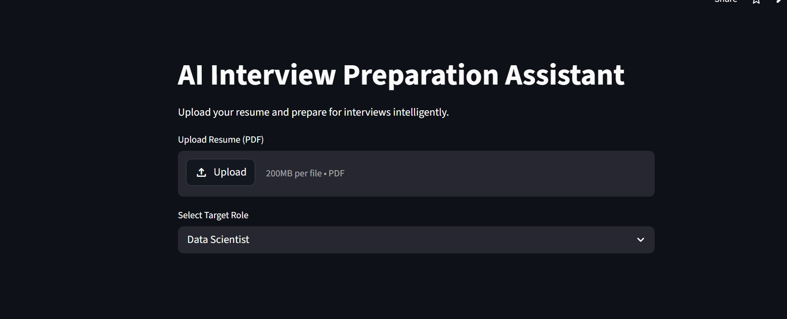

# 🎯 AI Interview Preparation Assistant

<div align="center">

### AI-Powered Resume Intelligence & Interview Preparation Platform

Prepare for technical interviews intelligently using resume analysis, role-based interview questions, skill evaluation, and AI-driven learning recommendations.

---


</div>

---

# 🚀 Features

## 📄 Resume PDF Analysis

* Upload resume PDFs directly into the application.
* Automatically extracts text using `pdfplumber`.
* Analyzes technical skills from resume content.

---

## 🧠 AI Resume Strength Scoring

* Calculates resume strength score based on detected technical skills.
* Evaluates resume readiness for technical interview preparation.

---

## 🛠 Technical Skill Detection

Detects important technical skills including:

* Python
* SQL
* Machine Learning
* Deep Learning
* TensorFlow
* NumPy
* Pandas
* Tableau
* Power BI
* Data Analysis

and more.

---

## ❌ Missing Skills Identification

* Detects missing skills based on selected target role.
* Helps candidates understand improvement areas before interviews.

---

## 🎯 Role-Based Interview Preparation

Supports multiple target roles:

* Data Scientist
* Machine Learning Engineer
* Data Analyst
* Software Engineer

---

## 💬 AI Interview Question Generator

Generates role-specific interview preparation questions such as:

* Machine Learning concepts
* SQL questions
* Data structures
* APIs
* Feature engineering
* Bias-variance tradeoff
* OOP concepts

and more.

---

## 📌 Personalized Preparation Suggestions

Provides personalized recommendations such as:

* Improving SQL knowledge
* Learning Machine Learning fundamentals
* Strengthening Python skills
* Practicing Deep Learning frameworks

---

## 🗺 Suggested Learning Roadmap

Generates customized learning roadmap depending on selected role.

Example:

* Statistics & Probability
* Machine Learning Projects
* TensorFlow & PyTorch
* DSA Practice
* System Design
* Dashboard Development

---

# 🖥️ Dashboard Preview

The application provides:

* Resume Upload System
* Resume Strength Analysis
* Skill Detection Engine
* Missing Skill Detection
* AI Interview Questions
* Learning Roadmaps
* Resume Suggestions
* Interactive Streamlit Dashboard

---

# 🛠️ Tech Stack

| Technology | Purpose                      |
| ---------- | ---------------------------- |
| Python     | Backend Logic                |
| Streamlit  | Interactive Web Application  |
| pdfplumber | PDF Resume Parsing           |
| NLP        | Resume Skill Analysis        |
| Pandas     | Data Processing              |
| AI Logic   | Interview Preparation Engine |

---

# 📂 Project Structure

```bash
AI-Interview-Preparation-Assistant/
│
├── app.py
├── requirements.txt
├── README.md
├── .gitignore
├── images/
│   └── image.png
└── venv/
```

---

# 🧠 System Architecture

```text
                ┌─────────────────────┐
                │ Resume PDF Upload   │
                └─────────┬───────────┘
                          │
                          ▼
                ┌─────────────────────┐
                │ PDF Text Extraction │
                │    (pdfplumber)     │
                └─────────┬───────────┘
                          │
                          ▼
                ┌─────────────────────┐
                │ Resume Skill        │
                │ Detection Engine    │
                └─────────┬───────────┘
                          │
          ┌───────────────┼────────────────┐
          ▼               ▼                ▼
 ┌─────────────┐ ┌────────────────┐ ┌─────────────────┐
 │ Resume      │ │ Missing Skills │ │ Role Prediction │
 │ Strength    │ │ Detection      │ │ & Target Role   │
 │ Score       │ │                │ │ Selection        │
 └──────┬──────┘ └────────┬───────┘ └────────┬────────┘
        │                 │                  │
        └─────────────────┼──────────────────┘
                          ▼
                ┌─────────────────────┐
                │ AI Interview        │
                │ Question Generator  │
                └─────────┬───────────┘
                          │
                          ▼
                ┌─────────────────────┐
                │ Learning Roadmap &  │
                │ Resume Suggestions  │
                └─────────────────────┘
```

---

# 📸 Screenshots

## Dashboard Preview

```md

```

---

# ⚙️ Installation

## Clone Repository

```bash
git clone https://github.com/Adro05/AI-Interview-Preparation-Assistant
```

---

## Install Dependencies

```bash
pip install -r requirements.txt
```

---

## Run Application

```bash
streamlit run app.py
```

---

# 🌐 Live Demo


```text
https://ai-interview-preparation-assistant-ndzdwsxam8tbvnrjxrgvr6.streamlit.app/
```

---

# 🔗 Repository Link

Add your GitHub repository link here:

```text
https://github.com/Adro05/AI-Interview-Preparation-Assistant
```

---

# 🎯 Future Improvements

* LLM-based interview feedback
* AI mock interview simulator
* Voice-based interview practice
* Resume rewriting suggestions
* GenAI-powered career roadmap
* Semantic resume analysis
* RAG-based recruiter evaluation

---

# 👨‍💻 Author

Developed by Aadhya Rohatgi using:

* Python
* Streamlit
* NLP
* AI-based Resume Intelligence

---

# ⭐ Project Highlights

* AI-powered interview preparation assistant
* Resume intelligence platform
* Technical skill analysis engine
* Role-based preparation workflow
* Interactive Streamlit dashboard
* Beginner-to-intermediate AI/NLP project
* Resume-worthy end-to-end application

---
